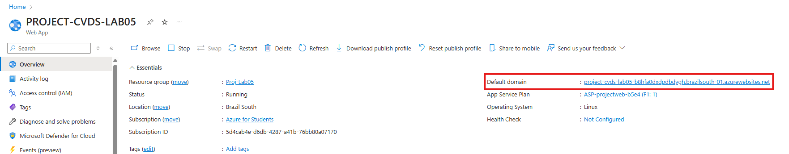
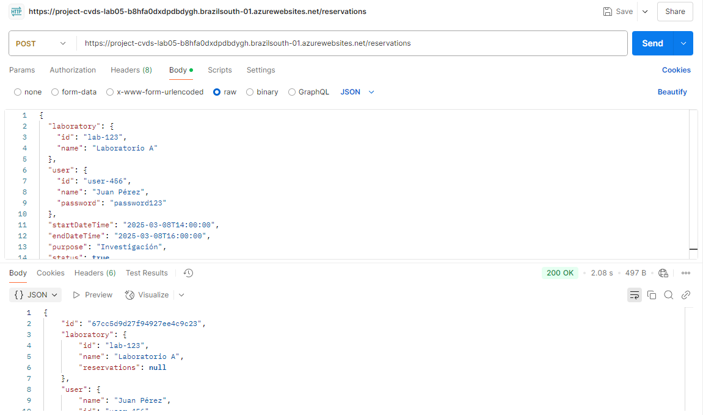
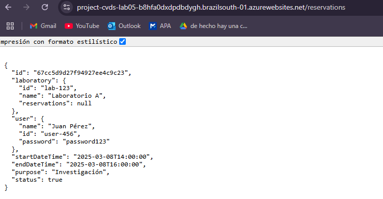

## Configuración Inicial

El flujo de CI/CD se compone de dos jobs:

1. **Build**:
    - Descarga el código del repositorio.
    - Configura JDK 17.
    - Compila el proyecto con Maven.
    - Genera un artefacto `.jar` para despliegue.

2. **Deploy**:
    - Descarga el artefacto generado en el paso anterior.
    - Inicia sesión en Azure.
    - Despliega la aplicación en Azure App Service.

## Resultado Final

Después de realizar estos ajustes, la aplicación se desplegó correctamente, para poder comprobar esto, se tomo el link que arroja Azure.

Esta URL se pone en Postman, para poder simular la creacion de una reserva.

El 200 ok representa que todo salio bien, debido a esto se puede poner la URL en Google y deberia aparecer la reserva creada, esto significa que el despliegue salio bien

## Autores
* **Cristian David Silva Perilla** - [CRISTIANSILVAP](https://github.com/CRISTIANSILVAP)
* **Juan Miguel Rojas Chaparro** - [juanmiguelrojas](https://github.com/juanmiguelrojas)
* **Laura Natalia Perilla Quintero** - [Lanapequin](https://github.com/Lanapequin)
* **Santiago Amaya Zapata** - [SantiagoAmaya21](https://github.com/SantiagoAmaya21)